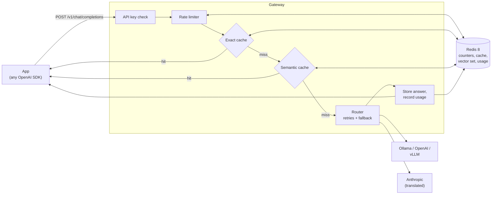

# LLM Gateway

[](https://github.com/VinayNekkanti/llm-gateway/actions/workflows/ci.yml)

An OpenAI-compatible gateway that sits between your apps and LLM providers. Point any
OpenAI SDK at it by changing `base_url`, and every request gets **caching (exact and
semantic), model routing, retries with fallback, per-key rate limits, and cost tracking**,
with no changes to application code.

```python
from openai import OpenAI

client = OpenAI(base_url="http://localhost:8000/v1", api_key="<your gateway key>")
client.chat.completions.create(model="fast", messages=[{"role": "user", "content": "Hi!"}])
```

## Results

Measured on one gateway process on a laptop, against a mock model that answers instantly,
so the numbers show the gateway's own cost ([full results](benchmarks/results.md)).

| | p50 latency added | Target |
|---|---|---|
| Pass-through (auth, rate limit, routing, usage tracking) | +1.1 ms | |
| Cache miss (plus exact + semantic lookup, embedding, store) | +7.8 ms | < 10 ms |
| Exact cache hit (total response time) | 0.9 ms | < 20 ms |
| Semantic cache hit (total response time) | 6.3 ms | < 20 ms |

On a 500-request workload of repeats, rewordings and look-alike questions, the caches
answered **62%** of requests (43% exact, 19% semantic) with **0 wrong answers**, cutting
estimated cost by **62%**.

## Features

- **Drop-in OpenAI API**: `POST /v1/chat/completions` (streaming and non-streaming) and
  `GET /v1/models`, with OpenAI-shaped requests, responses and error bodies.
- **Multiple providers**: any OpenAI-compatible API (Ollama, OpenAI, vLLM) plus Anthropic,
  with request, response and streaming translation. Model aliases like `fast` and `smart`.
- **Retries and fallback**: timeouts, 429s and 5xx errors are retried with exponential
  backoff and jitter, then routed to fallback models. Client errors fail fast.
- **Exact cache** in Redis: keyed by a hash of the real model, request and API key.
  Only low-temperature requests are cached, and errors never are.
- **Semantic cache**: local embeddings (`bge-small-en-v1.5`) plus Redis 8 vector sets
  reuse answers for reworded questions. The threshold was tuned on labeled pairs and checked
  on a held-out set ([write-up](docs/semantic-cache.md)).
- **Rate limiting** per API key with a sliding-window counter: `429` with `Retry-After`.
- **Cost tracking**: tokens, estimated cost and cache savings per key, model and day at
  `GET /usage`.
- **Observability**: JSON request logs with request IDs (structlog) and Prometheus metrics
  at `/metrics`.
- **Fails soft**: if Redis goes down, the gateway keeps serving (caching, rate limits and
  usage are skipped until it's back).

## Quickstart (Docker, about 2 minutes)

Prerequisites: [Docker](https://docs.docker.com/get-docker/) and
[Ollama](https://ollama.com) with the two small Llama models:

```bash
ollama pull llama3.2:1b
ollama pull llama3.2
```

Then:

```bash
git clone https://github.com/VinayNekkanti/llm-gateway.git
cd llm-gateway

# Create your secrets file with a random gateway key
cp .env.example .env
KEY="gw-$(python3 -c 'import secrets; print(secrets.token_urlsafe(24))')"
sed -i.bak "s/change-me/$KEY/g" .env && rm .env.bak

docker compose up --build
```

In another terminal:

```bash
source .env
curl http://localhost:8000/v1/chat/completions \
  -H "Authorization: Bearer $GATEWAY_API_KEY" \
  -H "Content-Type: application/json" \
  -d '{"model": "fast", "temperature": 0, "messages": [{"role": "user", "content": "Name three primary colors."}]}'
```

Run the same command again: the response header `x-gateway-cache: hit` shows it came from
the cache (add `-i` to see headers).

## Local development

Needs Python 3.12, [uv](https://docs.astral.sh/uv/), Redis 8 and Ollama.

```bash
uv sync
cp .env.example .env              # then set your keys
redis-server                      # or: docker run -p 6379:6379 redis:8
uv run --env-file .env llm-gateway
```

Try it with the official OpenAI client:

```bash
uv run --env-file .env python scripts/try_gateway.py     # one answer
uv run --env-file .env python scripts/try_streaming.py   # streamed answer
uv run --env-file .env python scripts/try_cache.py       # same request twice: miss, then hit
```

Checks (the same ones CI runs):

```bash
uv run ruff check . && uv run ruff format --check . && uv run mypy && uv run pytest
```

## API

| Endpoint | Auth | Description |
|---|---|---|
| `POST /v1/chat/completions` | key + rate limit | Chat completions, OpenAI format, `stream` supported |
| `GET /v1/models` | key | Model names from `config.yaml` |
| `GET /usage?days=30` | key | Tokens, estimated cost and cache savings for the calling key |
| `GET /health` | none | Liveness check |
| `GET /metrics` | none | Prometheus metrics (keep on an internal network) |

Authenticate with `Authorization: Bearer <key>`. Allowed keys come from `GATEWAY_API_KEYS`
(comma-separated) in `.env`.

**Request header**

| Header | Effect |
|---|---|
| `x-gateway-cache: skip` | Bypass both caches for this request |

**Response headers**

| Header | Meaning |
|---|---|
| `x-gateway-model` | Model that answered (differs from the request after a fallback) |
| `x-gateway-cache` | `hit`, `semantic-hit`, `miss` or `skip` |
| `x-gateway-similarity` | Cosine similarity of a semantic hit |
| `x-gateway-cost-usd` | Estimated cost of this request |
| `x-request-id` | ID shown in the gateway's logs for this request |

## Configuration

Settings live in [`config.yaml`](config.yaml) and secrets in `.env`. Any value can read an
environment variable with `${NAME:-default}`. Docker Compose uses this to point the same
file at the Redis container and at Ollama on the host. Set `GATEWAY_CONFIG` to use a
different file. The config is validated at startup, so a typo stops the server with a clear
error instead of failing on the first request.

| Setting | Default | Description |
|---|---|---|
| `providers.<name>.type` | | `openai` (any OpenAI-compatible API) or `anthropic` |
| `providers.<name>.base_url` | | API base URL |
| `providers.<name>.api_key_env` | none | Name of the env var holding the provider key |
| `providers.<name>.timeout_seconds` | 60 | Per-request timeout |
| `models.<name>.provider` | | Which provider serves this model name |
| `models.<name>.model` | | Model name the provider expects |
| `models.<name>.fallbacks` | `[]` | Model names to try, in order, if this one keeps failing |
| `models.<name>.drop_params` | `[]` | Request fields to strip for this model |
| `models.<name>.pricing` | none | `input_per_million` / `output_per_million` in USD |
| `retry.max_attempts` | 3 | Tries per model, including the first |
| `retry.initial_backoff_seconds` | 0.5 | First retry wait; doubles each time, plus jitter |
| `retry.max_backoff_seconds` | 4 | Longest wait between retries |
| `redis.url` | `redis://localhost:6379/0` | Redis connection |
| `redis.timeout_seconds` | 0.25 | Redis timeout; a slow Redis never slows the gateway much |
| `cache.shared_across_keys` | false | Share cache entries between API keys |
| `cache.max_temperature` | 0.3 | Only cache requests at or below this temperature (missing = 1.0) |
| `cache.exact.enabled` / `ttl_seconds` | true / 3600 | Exact cache |
| `cache.semantic.enabled` | false (true in `config.yaml`) | Semantic cache |
| `cache.semantic.similarity_threshold` | 0.94 | Minimum cosine similarity for a semantic hit |
| `cache.semantic.max_question_chars` | 300 | Longer questions skip the semantic cache |
| `cache.semantic.embedding_model` | `BAAI/bge-small-en-v1.5` | fastembed model |
| `rate_limit.enabled` | true | Per-key rate limiting |
| `rate_limit.requests_per_minute` | 60 | Limit per key per window |
| `rate_limit.window_seconds` | 60 | Window length |
| `rate_limit.per_key` | `{}` | Overrides by key id, e.g. `key_1a2b3c4d5e6f: 600` |

Environment variables: `GATEWAY_API_KEYS` (required), provider keys such as
`ANTHROPIC_API_KEY`, `GATEWAY_CONFIG`, `HOST`/`PORT` (default `127.0.0.1:8000`),
`LOG_LEVEL`, and `LOG_FORMAT=console` for readable logs instead of JSON.

## Architecture



| Module | Responsibility |
|---|---|
| `app.py` | HTTP only: routes, request logging middleware, startup and shutdown |
| `gateway.py` | The pipeline: cache lookups, provider call, cache store, usage |
| `router.py` | Model name to provider, retries with backoff, fallback order |
| `providers/` | One adapter per API type; OpenAI format in and out |
| `cache/` | Exact cache and semantic cache |
| `ratelimit.py`, `usage.py` | Per-key limits and cost tracking in Redis |
| `redis_store.py` | Redis wrapper that fails soft, with a short cooldown after errors |
| `observability.py` | Log setup and Prometheus metrics |

## Design decisions

- **Fail open on Redis errors.** Caching, rate limiting and usage tracking all depend on
  Redis. If Redis is down, the gateway keeps forwarding requests instead of failing them, so
  a cache outage doesn't become a full outage. A short cooldown keeps every request from
  waiting on a dead Redis.
- **The semantic cache favours safety over hit rate.** Embeddings score "10 miles to km"
  and "10 km to miles" at 0.99, higher than most real rewordings, so a threshold alone is
  unsafe. Cheap text checks (numbers, negation, word order, single-word swaps) catch these.
  The threshold was set for zero wrong answers on held-out data
  ([details](docs/semantic-cache.md)).
- **Cache entries are per API key by default**, so one client never receives an answer
  generated for another. Sharing is one config flag away when that's acceptable.
- **Sliding-window rate limits.** A fixed per-minute counter allows twice the limit in a
  burst around the minute boundary. Two counters per key weighted by overlap fix that with
  constant memory. Rejected requests don't use up quota.
- **Retries happen only before the first byte.** Once streamed text has reached the client
  it can't be taken back, so a stream that fails midway just ends.
- **Costs are stored as integer micro-dollars**, because adding floats drifts over many
  requests.
- **Raw API keys never leave the auth check.** Logs, metrics, usage and rate-limit
  overrides use a short SHA-256 key id.

## Testing

99 tests (pytest, respx for mocking providers, real Redis for cache, rate limit and usage
behaviour) at 97% coverage. CI fails below 80%. GitHub Actions runs Ruff, mypy and pytest
against a Redis 8 service container, and checks that the Docker image builds and becomes
healthy.

## Project layout

```
config.yaml            providers, models, cache, rate limits (no secrets)
src/llm_gateway/       the gateway (see Architecture)
tests/                 pytest suite
benchmarks/            Locust scenarios, mock upstream, cache workload, results
eval/                  labeled question pairs for the semantic cache
docs/                  design notes
scripts/               try-it scripts and the semantic threshold tuner
Dockerfile, docker-compose.yml
```

## Limitations

- Streaming responses are not cached (they are still rate limited and billed).
- The Anthropic adapter translates text and images, not tool calls.
- The semantic cache embeds only the last user message; earlier turns must match exactly.
- One gateway process handles roughly 900 pass-through or 300 cache-miss requests per
  second on a laptop; scale with more workers or replicas behind a load balancer.
